# System Context Map

**Project**: Multi-Tenant School Management System  
**Database**: PostgreSQL with Dynamic Schema-per-Tenant Architecture  
**Generated**: 2026-02-02

---

## Table of Contents
1. [Schema Overview](#schema-overview)
2. [Entity Relationship Diagram](#entity-relationship-diagram)
3. [Entity Relationships](#entity-relationships)
4. [Validation Constraints](#validation-constraints)
5. [Tenant Isolation Mechanism](#tenant-isolation-mechanism)
6. [JSON Schema Summary](#json-schema-summary)

---

## Schema Overview

### Public Schema (Shared across all tenants)

The `public` schema contains globally shared data:

| Table | Purpose | Primary Key |
|-------|---------|-------------|
| **organizations** | Stores organization/school metadata | `id` (UUID) |
| **uacn_registry** | Universal Aadhaar Credential Number registry - global user directory | `uacn` (VARCHAR) |
| **org_memberships** | Links users (UACN) to organizations with roles | `id` (UUID) |

### Tenant Schemas (Isolated per school)

Each school/organization gets its own PostgreSQL schema (e.g., `school_test`, `alpha_school`). The following tables exist in each tenant schema:

| Table | Purpose | Primary Key |
|-------|---------|-------------|
| **students** | Student enrollment records | `uacn` (VARCHAR) |
| **teachers** | Teacher staff records | `uacn` (VARCHAR) |
| **classes** | School classes/sections | `id` (UUID) |
| **subjects** | Academic subjects | `id` (UUID) |
| **marks** | Student marks/grades | `id` (UUID) |
| **attendance** | Daily attendance records | `id` (UUID) |
| **timetable** | Class schedules | `id` (UUID) |
| **student_contacts** | Student contact information | `uacn` (VARCHAR) |
| **parent_details** | Parent/guardian information | `id` (UUID) |
| **fee_installments** | Fee payment schedules | `id` (UUID) |
| **fee_payments** | Actual fee payment records | `id` (UUID) |
| **subject_assignments** | Teacher-subject-class assignments | `id` (UUID) |
| **audit_logs** | Audit trail for sensitive operations | `id` (UUID) |

---

## Entity Relationship Diagram

```mermaid
erDiagram
    %% PUBLIC SCHEMA
    uacn_registry ||--o{ org_memberships : "has"
    organizations ||--o{ org_memberships : "contains"
    
    %% TENANT SCHEMA - Core Entities
    classes ||--o{ students : "enrolls"
    classes ||--o{ timetable : "scheduled"
    classes ||--o{ subject_assignments : "assigned"
    
    students ||--|| student_contacts : "has"
    students ||--o{ parent_details : "has"
    students ||--o{ marks : "receives"
    students ||--o{ attendance : "tracks"
    students ||--o{ fee_installments : "owes"
    
    subjects ||--o{ marks : "for"
    subjects ||--o{ timetable : "taught"
    subjects ||--o{ subject_assignments : "assigned"
    
    teachers ||--o{ timetable : "teaches"
    teachers ||--o{ classes : "manages"
    
    fee_installments ||--o{ fee_payments : "paid_via"
    
    %% PUBLIC SCHEMA ENTITIES
    uacn_registry {
        varchar uacn PK "Unique Aadhaar Credential Number"
        varchar aadhaar_hash UK "SHA-256 hash of Aadhaar (UNIQUE)"
        varchar name "User's full name"
    }
    
    organizations {
        uuid id PK
        varchar name "Organization name"
        varchar schema_name UK "PostgreSQL schema name (UNIQUE)"
    }
    
    org_memberships {
        uuid id PK
        varchar member_uacn FK "References uacn_registry.uacn"
        uuid org_id FK "References organizations.id"
        varchar role "USER role: ADMIN, TEACHER, STUDENT, PARENT"
        date joined_at "Membership start date"
    }
    
    %% TENANT SCHEMA ENTITIES
    students {
        varchar uacn PK "References public.uacn_registry"
        varchar roll_number "School roll number"
        date admission_date "Date of admission"
        uuid class_id FK "References classes.id"
    }
    
    teachers {
        varchar uacn PK "References public.uacn_registry"
        varchar staff_id "School staff ID"
        varchar department "Teaching department"
    }
    
    classes {
        uuid id PK
        varchar name "Class name (e.g., 10th Grade)"
        varchar section "Section (A, B, C)"
        varchar class_teacher_uacn FK "References teachers.uacn"
    }
    
    subjects {
        uuid id PK
        varchar name "Subject name"
    }
    
    marks {
        uuid id PK
        varchar uacn FK "References students.uacn"
        uuid subject_id FK "References subjects.id"
        int score_obtained "Marks obtained"
        int max_score "Maximum marks"
        varchar term "Academic term"
    }
    
    attendance {
        uuid id PK
        varchar uacn FK "References students.uacn"
        date date "Attendance date"
        varchar status "PRESENT, ABSENT, LATE"
    }
    
    timetable {
        uuid id PK
        uuid class_id FK "References classes.id"
        uuid subject_id FK "References subjects.id"
        varchar teacher_uacn FK "References teachers.uacn"
        varchar day "Day of week"
        varchar time_slot "Time slot"
    }
    
    student_contacts {
        varchar uacn PK,FK "References students.uacn (OneToOne)"
        varchar address "Residential address"
        varchar phone "Contact phone"
        varchar email "Email address"
        varchar emergency_contact "Emergency phone"
    }
    
    parent_details {
        uuid id PK
        varchar uacn FK "References students.uacn (ManyToOne, NOT NULL)"
        varchar father_name "Father's name"
        varchar mother_name "Mother's name"
        varchar primary_phone "Primary contact"
        varchar occupation "Parent occupation"
    }
    
    fee_installments {
        uuid id PK
        varchar uacn FK "References students.uacn (ManyToOne, NOT NULL)"
        varchar category_name "Fee category"
        decimal amount_due "Amount due"
        date due_date "Payment deadline"
        varchar status "PENDING, PAID, OVERDUE"
    }
    
    fee_payments {
        uuid id PK
        uuid installment_id FK "References fee_installments.id (ManyToOne, NOT NULL)"
        decimal amount_paid "Amount paid"
        date payment_date "Date of payment"
        varchar payment_mode "CASH, CARD, UPI, etc."
        varchar transaction_ref "Transaction reference"
    }
    
    subject_assignments {
        uuid id PK
        varchar uacn "Teacher UACN"
        uuid subject_id "References subjects.id"
        uuid class_id FK "References classes.id"
    }
    
    audit_logs {
        uuid id PK
        varchar action_by_uacn "Actor UACN"
        varchar target_uacn "Target user UACN"
        varchar action_type "Action type"
        timestamp timestamp "Action timestamp"
    }
```



---

## Entity Relationships

### Public Schema Entities

#### 1. **Organization**
- **Schema**: `public`
- **Table**: `organizations`
- **Primary Key**: `id` (UUID)
- **Foreign Keys**: None
- **Relationships**: 
  - `@OneToMany` → `OrgMembership` (one organization has many memberships)
- **Unique Constraints**: `schema_name` must be unique

#### 2. **UacnRegistry**
- **Schema**: `public`
- **Table**: `uacn_registry`
- **Primary Key**: `uacn` (VARCHAR)
- **Foreign Keys**: None
- **Relationships**: 
  - `@OneToMany` → `OrgMembership` (one user can be member of multiple orgs)
- **Unique Constraints**: 
  - `aadhaar_hash` must be unique (ensures one Aadhaar = one UACN)

#### 3. **OrgMembership**
- **Schema**: `public`
- **Table**: `org_memberships`
- **Primary Key**: `id` (UUID)
- **Foreign Keys**: 
  - `member_uacn` → `uacn_registry.uacn`
  - `org_id` → `organizations.id`
- **Relationships**: 
  - `@ManyToOne` → `UacnRegistry`
  - `@ManyToOne` → `Organization`

---

### Tenant Schema Entities

#### 4. **Student**
- **Schema**: Tenant-specific (e.g., `school_test`)
- **Table**: `students`
- **Primary Key**: `uacn` (VARCHAR)
- **Foreign Keys**: 
  - `class_id` → `classes.id` (implicit, stored as UUID field)
- **Relationships**: 
  - `@OneToOne` → `StudentContact`
  - `@OneToMany` → `ParentDetail`
  - `@OneToMany` → `FeeInstallment`
  - `@OneToMany` → `Marks`
  - `@OneToMany` → `Attendance`

#### 5. **Teacher**
- **Schema**: Tenant-specific
- **Table**: `teachers`
- **Primary Key**: `uacn` (VARCHAR)
- **Foreign Keys**: None (but UACN references `public.uacn_registry` at application level)
- **Relationships**: 
  - Referenced by `SchoolClass.classTeacherUacn`
  - Referenced by `Timetable.teacherUacn`

#### 6. **SchoolClass**
- **Schema**: Tenant-specific
- **Table**: `classes`
- **Primary Key**: `id` (UUID)
- **Foreign Keys**: 
  - `class_teacher_uacn` → `teachers.uacn` (implicit)
- **Relationships**: 
  - Referenced by `Student.classId`
  - Referenced by `Timetable.classId`
  - Referenced by `SubjectAssignment.classId`

#### 7. **Subject**
- **Schema**: Tenant-specific
- **Table**: `subjects`
- **Primary Key**: `id` (UUID)
- **Foreign Keys**: None
- **Relationships**: 
  - Referenced by `Marks.subjectId`
  - Referenced by `Timetable.subjectId`
  - Referenced by `SubjectAssignment.subjectId`

#### 8. **Marks**
- **Schema**: Tenant-specific
- **Table**: `marks`
- **Primary Key**: `id` (UUID)
- **Foreign Keys**: 
  - `uacn` → `students.uacn`
  - `subject_id` → `subjects.id`
- **Relationships**: 
  - `@ManyToOne` → `Student` (implicit)
  - `@ManyToOne` → `Subject` (implicit)

#### 9. **Attendance**
- **Schema**: Tenant-specific
- **Table**: `attendance`
- **Primary Key**: `id` (UUID)
- **Foreign Keys**: 
  - `uacn` → `students.uacn`
- **Relationships**: 
  - `@ManyToOne` → `Student` (implicit)

#### 10. **Timetable**
- **Schema**: Tenant-specific
- **Table**: `timetable`
- **Primary Key**: `id` (UUID)
- **Foreign Keys**: 
  - `class_id` → `classes.id`
  - `subject_id` → `subjects.id`
  - `teacher_uacn` → `teachers.uacn`
- **Relationships**: 
  - `@ManyToOne` → `SchoolClass` (implicit)
  - `@ManyToOne` → `Subject` (implicit)
  - `@ManyToOne` → `Teacher` (implicit)

#### 11. **StudentContact**
- **Schema**: Tenant-specific
- **Table**: `student_contacts`
- **Primary Key**: `uacn` (VARCHAR)
- **Foreign Keys**: 
  - `uacn` → `students.uacn`
- **Relationships**: 
  - `@OneToOne` → `Student` (using `@MapsId`)

#### 12. **ParentDetail**
- **Schema**: Tenant-specific
- **Table**: `parent_details`
- **Primary Key**: `id` (UUID, auto-generated)
- **Foreign Keys**: 
  - `uacn` → `students.uacn` (NOT NULL)
- **Relationships**: 
  - `@ManyToOne` → `Student`

#### 13. **FeeInstallment**
- **Schema**: Tenant-specific
- **Table**: `fee_installments`
- **Primary Key**: `id` (UUID, auto-generated)
- **Foreign Keys**: 
  - `uacn` → `students.uacn` (NOT NULL)
- **Relationships**: 
  - `@ManyToOne` → `Student`
  - `@OneToMany` → `FeePayment`

#### 14. **FeePayment**
- **Schema**: Tenant-specific
- **Table**: `fee_payments`
- **Primary Key**: `id` (UUID, auto-generated)
- **Foreign Keys**: 
  - `installment_id` → `fee_installments.id` (NOT NULL)
- **Relationships**: 
  - `@ManyToOne` → `FeeInstallment`

#### 15. **SubjectAssignment**
- **Schema**: Tenant-specific
- **Table**: `subject_assignments`
- **Primary Key**: `id` (UUID)
- **Foreign Keys**: 
  - `class_id` → `classes.id`
- **Relationships**: 
  - Implicit references to `Subject` and `Teacher` via UUIDs

#### 16. **AuditLog**
- **Schema**: Tenant-specific
- **Table**: `audit_logs`
- **Primary Key**: `id` (UUID)
- **Foreign Keys**: None (stores UACNs as strings for flexibility)
- **Relationships**: None (decoupled for audit integrity)

---

## Validation Constraints

### Column-Level Constraints

#### Public Schema

**UacnRegistry**:
- `aadhaar_hash`: `UNIQUE`, `NOT NULL` - Ensures one Aadhaar can only create one UACN
- Custom Validator: Aadhaar hashing uses SHA-256 before storage (never store raw Aadhaar)

**Organization**:
- `schema_name`: `UNIQUE`, `NOT NULL` - Each organization gets exactly one PostgreSQL schema

**OrgMembership**:
- `member_uacn`: `NOT NULL`, Foreign Key constraint
- `org_id`: `NOT NULL`, Foreign Key constraint

#### Tenant Schema

**StudentContact**:
- `@OneToOne` with `@MapsId` - Ensures exactly one contact record per student

**ParentDetail**:
- `uacn`: `nullable = false` - Students must have at least one parent record
- `@ManyToOne` - Allows multiple parents per student

**FeeInstallment**:
- `uacn`: `nullable = false` - Every installment must be linked to a student
- `@ManyToOne` - Multiple installments per student

**FeePayment**:
- `installment_id`: `nullable = false` - Every payment must link to an installment
- `@ManyToOne` - Multiple payments can be made against one installment (partial payments)

### Entity-Level Constraints

**Auto-Generated PKs**:
- `ParentDetail`, `FeeInstallment`, `FeePayment` use `@GeneratedValue(strategy = GenerationType.AUTO)`
- Ensures unique IDs without manual assignment

**Relationship Integrity**:
- All foreign key relationships enforce referential integrity at the database level
- Cascading not explicitly defined in JPA annotations, relies on database constraints

---

## Tenant Isolation Mechanism

### How X-Tenant-ID Header Works

The application implements **schema-based multi-tenancy** using Hibernate's `CurrentTenantIdentifierResolver`. Here's the isolation flow:

#### 1. **Request Interception** ([TenantFilter.java](file:///Users/gautamawasthi/Documents/TheSProject/src/main/java/com/example/multitenancy/TenantFilter.java))

```java
@Component
@Order(Ordered.HIGHEST_PRECEDENCE)
public class TenantFilter implements Filter {
    public static final String TENANT_HEADER = "X-Tenant-ID";
    
    @Override
    public void doFilter(ServletRequest request, ServletResponse response, FilterChain chain) {
        HttpServletRequest req = (HttpServletRequest) request;
        String tenantId = req.getHeader(TENANT_HEADER);
        
        if (tenantId != null && !tenantId.isEmpty()) {
            TenantContext.setCurrentTenant(tenantId);  // Set ThreadLocal
        }
        
        try {
            chain.doFilter(request, response);  // Process request
        } finally {
            TenantContext.clear();  // Clean up ThreadLocal
        }
    }
}
```

**Key Points**:
- Runs at `HIGHEST_PRECEDENCE` - executes before Spring Security
- Extracts `X-Tenant-ID` header from incoming HTTP request
- Stores tenant ID in `ThreadLocal` context for the request lifecycle
- **Always clears** ThreadLocal in `finally` block to prevent thread pool contamination

#### 2. **Thread-Local Storage** ([TenantContext.java](file:///Users/gautamawasthi/Documents/TheSProject/src/main/java/com/example/multitenancy/TenantContext.java))

```java
public class TenantContext {
    private static final ThreadLocal<String> CURRENT_TENANT = new ThreadLocal<>();
    
    public static void setCurrentTenant(String tenant) {
        CURRENT_TENANT.set(tenant);
    }
    
    public static String getCurrentTenant() {
        return CURRENT_TENANT.get();
    }
    
    public static void clear() {
        CURRENT_TENANT.remove();
    }
}
```

**Key Points**:
- Uses `ThreadLocal` to isolate tenant context per request thread
- Thread-safe for concurrent requests
- Each HTTP request thread maintains its own tenant ID

#### 3. **Hibernate Schema Resolution** ([TenantIdentifierResolver.java](file:///Users/gautamawasthi/Documents/TheSProject/src/main/java/com/example/multitenancy/TenantIdentifierResolver.java))

```java
@Component
public class TenantIdentifierResolver implements CurrentTenantIdentifierResolver {
    
    @Override
    public String resolveCurrentTenantIdentifier() {
        String tenantId = TenantContext.getCurrentTenant();
        if (tenantId != null && !tenantId.isBlank()) {
            return tenantId;  // Use tenant-specific schema (e.g., "school_test")
        }
        return "PUBLIC";  // Fallback to public schema
    }
    
    @Override
    public boolean validateExistingCurrentSessions() {
        return true;
    }
}
```

**Key Points**:
- Hibernate calls this **before every database query**
- Returns the schema name to use for the current transaction
- Falls back to `PUBLIC` schema if no tenant header provided
- Enables seamless schema switching without connection changes

#### 4. **Request Flow Example**

```
Client Request → TenantFilter → TenantContext → Hibernate Query → Database
     ↓                ↓              ↓                ↓              ↓
X-Tenant-ID:    Extract header  Store in      Resolve schema   Execute in
school_test                     ThreadLocal    → "school_test"  school_test schema
```

#### 5. **Schema Isolation Guarantees**

✅ **What is Isolated**:
- All queries to tenant-specific tables (`students`, `teachers`, `marks`, etc.) execute in the tenant's schema
- No cross-tenant data leakage - Schema A cannot access Schema B's data
- Public schema tables (`organizations`, `uacn_registry`) are accessible by all tenants

✅ **Security Considerations**:
- **Header Injection Prevention**: Validate X-Tenant-ID against authenticated user's org membership
- **Schema Provisioning**: New schemas created dynamically via `SuperAdminController`
- **Connection Pooling**: Uses single connection pool with schema switching (efficient resource usage)

⚠️ **Current Limitations**:
- No tenant validation in current `TenantFilter` - relies on downstream authorization
- If X-Tenant-ID header is missing, defaults to `PUBLIC` schema (safe fallback)

---

## JSON Schema Summary

```json
{
  "database": "PostgreSQL",
  "multitenancy_model": "schema-per-tenant",
  "schemas": {
    "public": {
      "description": "Shared global data across all tenants",
      "tables": [
        {
          "name": "organizations",
          "primaryKey": "id (UUID)",
          "foreignKeys": [],
          "uniqueConstraints": ["schema_name"],
          "columns": [
            { "name": "id", "type": "UUID", "constraints": ["PRIMARY KEY"] },
            { "name": "name", "type": "VARCHAR(255)", "constraints": ["NOT NULL"] },
            { "name": "schema_name", "type": "VARCHAR(255)", "constraints": ["NOT NULL", "UNIQUE"] }
          ]
        },
        {
          "name": "uacn_registry",
          "primaryKey": "uacn (VARCHAR)",
          "foreignKeys": [],
          "uniqueConstraints": ["aadhaar_hash"],
          "columns": [
            { "name": "uacn", "type": "VARCHAR(255)", "constraints": ["PRIMARY KEY"] },
            { "name": "aadhaar_hash", "type": "VARCHAR(255)", "constraints": ["NOT NULL", "UNIQUE"] },
            { "name": "name", "type": "VARCHAR(255)", "constraints": ["NOT NULL"] }
          ],
          "validationRules": [
            "Aadhaar must be hashed using SHA-256 before storage",
            "One Aadhaar number can only create one UACN (enforced by unique hash)"
          ]
        },
        {
          "name": "org_memberships",
          "primaryKey": "id (UUID)",
          "foreignKeys": [
            { "column": "member_uacn", "references": "uacn_registry.uacn" },
            { "column": "org_id", "references": "organizations.id" }
          ],
          "columns": [
            { "name": "id", "type": "UUID", "constraints": ["PRIMARY KEY"] },
            { "name": "member_uacn", "type": "VARCHAR(255)", "constraints": ["NOT NULL", "FOREIGN KEY"] },
            { "name": "org_id", "type": "UUID", "constraints": ["NOT NULL", "FOREIGN KEY"] },
            { "name": "role", "type": "VARCHAR(50)", "constraints": ["NOT NULL"] },
            { "name": "joined_at", "type": "DATE", "constraints": [] }
          ]
        }
      ]
    },
    "tenant_template": {
      "description": "Each organization/school has its own schema with these tables",
      "schema_naming": "Dynamic (e.g., 'school_test', 'alpha_school')",
      "tables": [
        {
          "name": "students",
          "primaryKey": "uacn (VARCHAR)",
          "foreignKeys": [
            { "column": "class_id", "references": "classes.id", "jpaMapping": "implicit" }
          ],
          "columns": [
            { "name": "uacn", "type": "VARCHAR(255)", "constraints": ["PRIMARY KEY"] },
            { "name": "roll_number", "type": "VARCHAR(50)", "constraints": [] },
            { "name": "admission_date", "type": "DATE", "constraints": [] },
            { "name": "class_id", "type": "UUID", "constraints": ["FOREIGN KEY"] }
          ],
          "relationships": [
            { "type": "@OneToOne", "target": "StudentContact", "mappedBy": "student" },
            { "type": "@OneToMany", "target": "ParentDetail", "mappedBy": "student" },
            { "type": "@OneToMany", "target": "FeeInstallment", "mappedBy": "student" }
          ]
        },
        {
          "name": "teachers",
          "primaryKey": "uacn (VARCHAR)",
          "foreignKeys": [],
          "columns": [
            { "name": "uacn", "type": "VARCHAR(255)", "constraints": ["PRIMARY KEY"] },
            { "name": "staff_id", "type": "VARCHAR(50)", "constraints": [] },
            { "name": "department", "type": "VARCHAR(100)", "constraints": [] }
          ]
        },
        {
          "name": "classes",
          "primaryKey": "id (UUID)",
          "foreignKeys": [
            { "column": "class_teacher_uacn", "references": "teachers.uacn", "jpaMapping": "implicit" }
          ],
          "columns": [
            { "name": "id", "type": "UUID", "constraints": ["PRIMARY KEY"] },
            { "name": "name", "type": "VARCHAR(100)", "constraints": ["NOT NULL"] },
            { "name": "section", "type": "VARCHAR(10)", "constraints": [] },
            { "name": "class_teacher_uacn", "type": "VARCHAR(255)", "constraints": [] }
          ]
        },
        {
          "name": "subjects",
          "primaryKey": "id (UUID)",
          "foreignKeys": [],
          "columns": [
            { "name": "id", "type": "UUID", "constraints": ["PRIMARY KEY"] },
            { "name": "name", "type": "VARCHAR(100)", "constraints": ["NOT NULL"] }
          ]
        },
        {
          "name": "marks",
          "primaryKey": "id (UUID)",
          "foreignKeys": [
            { "column": "uacn", "references": "students.uacn" },
            { "column": "subject_id", "references": "subjects.id" }
          ],
          "columns": [
            { "name": "id", "type": "UUID", "constraints": ["PRIMARY KEY"] },
            { "name": "uacn", "type": "VARCHAR(255)", "constraints": ["NOT NULL", "FOREIGN KEY"] },
            { "name": "subject_id", "type": "UUID", "constraints": ["NOT NULL", "FOREIGN KEY"] },
            { "name": "score_obtained", "type": "INT", "constraints": [] },
            { "name": "max_score", "type": "INT", "constraints": [] },
            { "name": "term", "type": "VARCHAR(50)", "constraints": [] }
          ]
        },
        {
          "name": "attendance",
          "primaryKey": "id (UUID)",
          "foreignKeys": [
            { "column": "uacn", "references": "students.uacn" }
          ],
          "columns": [
            { "name": "id", "type": "UUID", "constraints": ["PRIMARY KEY"] },
            { "name": "uacn", "type": "VARCHAR(255)", "constraints": ["NOT NULL", "FOREIGN KEY"] },
            { "name": "date", "type": "DATE", "constraints": ["NOT NULL"] },
            { "name": "status", "type": "VARCHAR(20)", "constraints": [] }
          ]
        },
        {
          "name": "timetable",
          "primaryKey": "id (UUID)",
          "foreignKeys": [
            { "column": "class_id", "references": "classes.id" },
            { "column": "subject_id", "references": "subjects.id" },
            { "column": "teacher_uacn", "references": "teachers.uacn" }
          ],
          "columns": [
            { "name": "id", "type": "UUID", "constraints": ["PRIMARY KEY"] },
            { "name": "class_id", "type": "UUID", "constraints": ["NOT NULL", "FOREIGN KEY"] },
            { "name": "subject_id", "type": "UUID", "constraints": ["NOT NULL", "FOREIGN KEY"] },
            { "name": "teacher_uacn", "type": "VARCHAR(255)", "constraints": ["NOT NULL", "FOREIGN KEY"] },
            { "name": "day", "type": "VARCHAR(20)", "constraints": [] },
            { "name": "time_slot", "type": "VARCHAR(50)", "constraints": [] }
          ]
        },
        {
          "name": "student_contacts",
          "primaryKey": "uacn (VARCHAR)",
          "foreignKeys": [
            { "column": "uacn", "references": "students.uacn" }
          ],
          "columns": [
            { "name": "uacn", "type": "VARCHAR(255)", "constraints": ["PRIMARY KEY", "FOREIGN KEY"] },
            { "name": "address", "type": "TEXT", "constraints": [] },
            { "name": "phone", "type": "VARCHAR(20)", "constraints": [] },
            { "name": "email", "type": "VARCHAR(100)", "constraints": [] },
            { "name": "emergency_contact", "type": "VARCHAR(20)", "constraints": [] }
          ],
          "relationships": [
            { "type": "@OneToOne", "target": "Student", "joinColumn": "uacn", "mapsId": true }
          ]
        },
        {
          "name": "parent_details",
          "primaryKey": "id (UUID, auto-generated)",
          "foreignKeys": [
            { "column": "uacn", "references": "students.uacn", "nullable": false }
          ],
          "columns": [
            { "name": "id", "type": "UUID", "constraints": ["PRIMARY KEY", "AUTO_GENERATED"] },
            { "name": "uacn", "type": "VARCHAR(255)", "constraints": ["NOT NULL", "FOREIGN KEY"] },
            { "name": "father_name", "type": "VARCHAR(255)", "constraints": [] },
            { "name": "mother_name", "type": "VARCHAR(255)", "constraints": [] },
            { "name": "primary_phone", "type": "VARCHAR(20)", "constraints": [] },
            { "name": "occupation", "type": "VARCHAR(100)", "constraints": [] }
          ],
          "relationships": [
            { "type": "@ManyToOne", "target": "Student", "joinColumn": "uacn", "nullable": false }
          ]
        },
        {
          "name": "fee_installments",
          "primaryKey": "id (UUID, auto-generated)",
          "foreignKeys": [
            { "column": "uacn", "references": "students.uacn", "nullable": false }
          ],
          "columns": [
            { "name": "id", "type": "UUID", "constraints": ["PRIMARY KEY", "AUTO_GENERATED"] },
            { "name": "uacn", "type": "VARCHAR(255)", "constraints": ["NOT NULL", "FOREIGN KEY"] },
            { "name": "category_name", "type": "VARCHAR(100)", "constraints": [] },
            { "name": "amount_due", "type": "DECIMAL(10,2)", "constraints": [] },
            { "name": "due_date", "type": "DATE", "constraints": [] },
            { "name": "status", "type": "VARCHAR(20)", "constraints": [] }
          ],
          "relationships": [
            { "type": "@ManyToOne", "target": "Student", "joinColumn": "uacn", "nullable": false },
            { "type": "@OneToMany", "target": "FeePayment", "mappedBy": "feeInstallment" }
          ]
        },
        {
          "name": "fee_payments",
          "primaryKey": "id (UUID, auto-generated)",
          "foreignKeys": [
            { "column": "installment_id", "references": "fee_installments.id", "nullable": false }
          ],
          "columns": [
            { "name": "id", "type": "UUID", "constraints": ["PRIMARY KEY", "AUTO_GENERATED"] },
            { "name": "installment_id", "type": "UUID", "constraints": ["NOT NULL", "FOREIGN KEY"] },
            { "name": "amount_paid", "type": "DECIMAL(10,2)", "constraints": [] },
            { "name": "payment_date", "type": "DATE", "constraints": [] },
            { "name": "payment_mode", "type": "VARCHAR(50)", "constraints": [] },
            { "name": "transaction_ref", "type": "VARCHAR(100)", "constraints": [] }
          ],
          "relationships": [
            { "type": "@ManyToOne", "target": "FeeInstallment", "joinColumn": "installment_id", "nullable": false }
          ]
        },
        {
          "name": "subject_assignments",
          "primaryKey": "id (UUID)",
          "foreignKeys": [
            { "column": "class_id", "references": "classes.id" }
          ],
          "columns": [
            { "name": "id", "type": "UUID", "constraints": ["PRIMARY KEY"] },
            { "name": "uacn", "type": "VARCHAR(255)", "constraints": [] },
            { "name": "subject_id", "type": "UUID", "constraints": [] },
            { "name": "class_id", "type": "UUID", "constraints": ["FOREIGN KEY"] }
          ]
        },
        {
          "name": "audit_logs",
          "primaryKey": "id (UUID)",
          "foreignKeys": [],
          "columns": [
            { "name": "id", "type": "UUID", "constraints": ["PRIMARY KEY"] },
            { "name": "action_by_uacn", "type": "VARCHAR(255)", "constraints": [] },
            { "name": "target_uacn", "type": "VARCHAR(255)", "constraints": [] },
            { "name": "action_type", "type": "VARCHAR(50)", "constraints": [] },
            { "name": "timestamp", "type": "TIMESTAMP", "constraints": [] }
          ],
          "description": "Decoupled audit trail - no FK constraints for data integrity"
        }
      ]
    }
  },
  "tenantIsolation": {
    "mechanism": "Hibernate CurrentTenantIdentifierResolver with schema switching",
    "header": "X-Tenant-ID",
    "components": [
      {
        "name": "TenantFilter",
        "order": "Ordered.HIGHEST_PRECEDENCE",
        "responsibility": "Extract X-Tenant-ID header and populate ThreadLocal"
      },
      {
        "name": "TenantContext",
        "responsibility": "Maintain thread-safe tenant identifier via ThreadLocal"
      },
      {
        "name": "TenantIdentifierResolver",
        "responsibility": "Resolve current schema name for Hibernate queries",
        "fallback": "PUBLIC schema when no tenant ID provided"
      }
    ],
    "securityNotes": [
      "All tenant entities are isolated to their respective PostgreSQL schemas",
      "Public schema tables are shared across all tenants",
      "Schema switching happens transparently at query execution time",
      "ThreadLocal ensures concurrent requests don't interfere",
      "Requires downstream validation to ensure authenticated user has access to requested tenant"
    ]
  },
  "validationRules": {
    "aadhaarHashing": {
      "entity": "UacnRegistry",
      "field": "aadhaarHash",
      "algorithm": "SHA-256",
      "constraint": "UNIQUE",
      "rationale": "Never store raw Aadhaar numbers; hash ensures PII protection"
    },
    "oneToOneRelationships": [
      {
        "parent": "Student",
        "child": "StudentContact",
        "implementation": "@OneToOne with @MapsId",
        "constraint": "Exactly one contact record per student"
      }
    ],
    "notNullForeignKeys": [
      {
        "entity": "ParentDetail",
        "field": "student",
        "constraint": "nullable = false",
        "rationale": "Parent record must be linked to a valid student"
      },
      {
        "entity": "FeeInstallment",
        "field": "student",
        "constraint": "nullable = false",
        "rationale": "Fee installment must be linked to a valid student"
      },
      {
        "entity": "FeePayment",
        "field": "feeInstallment",
        "constraint": "nullable = false",
        "rationale": "Payment must be linked to a valid installment"
      }
    ]
  }
}
```

---

## Summary

This System Context Map provides a comprehensive overview of the multi-tenant school management system:

- **16 @Entity classes** spanning public and tenant schemas
- **Schema-based isolation** ensuring complete data separation between schools
- **X-Tenant-ID header-driven** dynamic schema resolution via Hibernate
- **Strong referential integrity** with explicit foreign keys and NOT NULL constraints
- **Aadhaar privacy protection** through SHA-256 hashing requirements

**Key Architectural Decisions**:
1. ✅ Public schema for shared identity (UACN) and organization metadata
2. ✅ Tenant schemas for complete data isolation per school
3. ✅ ThreadLocal-based tenant context for thread-safe concurrent requests
4. ✅ Hibernate's multi-tenancy support for seamless schema switching

**For Collaborators**: This document should be paired with the actual source code for implementation details. All file references are clickable links to the exact source locations.

---

## 🔄 Maintenance Guide

### When to Update This Document

Update this System Context Map whenever you make changes to:
- ✏️ **Entity Classes**: Add, modify, or remove `@Entity` classes
- 🗄️ **Database Schemas**: Modify SQL migration files or table structures
- 🔗 **Relationships**: Change JPA annotations (@OneToMany, @ManyToOne, etc.)
- ✅ **Validation Constraints**: Add or modify unique constraints, NOT NULL requirements, or custom validators
- 🏢 **Tenant Isolation**: Modify the multi-tenancy mechanism (TenantFilter, TenantContext, etc.)

### How to Regenerate This Document

Follow these steps to update the System Context Map:

#### Step 1: Run the Generation Prompt

Use the following prompt with your AI assistant (or copy it directly):

````markdown
Act as a Senior Software Architect. I need to update the comprehensive System Context Map of this project. Please scan all @Entity classes and database migration files to regenerate the following:

1. **Schema Overview**: List all tables organized by schema (public vs. tenant).

2. **Entity Relationships**: For every entity, list its Primary Key, Foreign Keys (and which tables they point to), and the relationship type (e.g., @OneToMany, @ManyToMany).

3. **Validation Constraints**: List key constraints (e.g., @Column(unique=true), @NotNull, or Custom Validators like Aadhaar hashing requirements).

4. **Tenant Isolation**: Briefly explain how the X-Tenant-ID header is currently being used to filter these entities.

5. **Output Format**: Provide this as a Mermaid.js Entity Relationship Diagram (ERD) followed by a structured JSON Summary of the fields.

Update the existing `SYSTEM_CONTEXT_MAP.md` file at the root of the project with the latest information.
````

#### Step 2: Review the Changes

After regeneration:
1. ✅ Verify the Mermaid ERD renders correctly
2. ✅ Check that all new entities are included
3. ✅ Confirm foreign key relationships are accurate
4. ✅ Validate constraint documentation matches actual code

#### Step 3: Update the Generated Date

Update the header metadata:
```markdown
**Generated**: YYYY-MM-DD
```

### Manual Update Guidelines

If making small, targeted updates without full regeneration:

#### Adding a New Entity
1. Add table to appropriate schema section (public or tenant)
2. Add entity definition to Mermaid ERD
3. Add detailed breakdown to "Entity Relationships" section
4. Update JSON schema summary
5. Document any new validation constraints

#### Modifying a Relationship
1. Update the Mermaid ERD relationship arrows
2. Update the entity's "Relationships" section
3. Update foreign key documentation
4. Sync changes to JSON schema summary

#### Changing Constraints
1. Update "Validation Constraints" section
2. Update entity field documentation
3. Update JSON schema with new constraint info

### Validation Checklist

Before committing updates, verify:

- [ ] All @Entity classes from `src/main/java/com/example/domain/` are documented
- [ ] Public schema SQL (`init-db/01-schema.sql`) matches documentation
- [ ] Tenant template SQL (`src/main/resources/tenant_template.sql`) matches documentation
- [ ] Mermaid ERD syntax is valid (test with preview)
- [ ] All file links use absolute paths and are clickable
- [ ] JSON schema is valid JSON (use a linter)
- [ ] Tenant isolation mechanism explanation is current

### File Locations Reference

When regenerating, scan these locations:

**Entity Classes**:
```
src/main/java/com/example/domain/*.java
```

**Database Migrations**:
```
init-db/01-schema.sql           # Public schema
src/main/resources/tenant_template.sql  # Tenant schema template
```

**Multi-Tenancy Implementation**:
```
src/main/java/com/example/multitenancy/TenantFilter.java
src/main/java/com/example/multitenancy/TenantContext.java
src/main/java/com/example/multitenancy/TenantIdentifierResolver.java
```

---

**Last Updated**: 2026-02-02  
**Document Version**: 1.0  
**Maintainer**: Development Team
